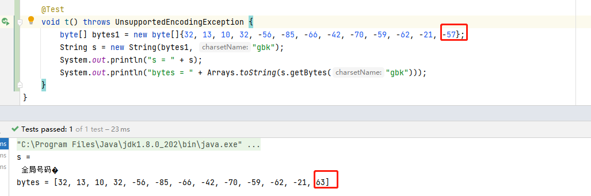

= commons-connect

== 简介

=== 特性

commons-connect项目为连接设备和下发指令提供了更简单易用的API，

=== 要求
JDK版本在1.8以上

=== 安装
在项目的pom文件中引入commons-connect-core依赖并配置本地maven仓库

[source,xml,subs="verbatim"]
----
    <dependencies>
        <dependency>
            <groupId>io.github.pxzxj</groupId>
            <artifactId>commons-connect-core</artifactId>
            <version>0.1.0</version>
        </dependency>
    </dependencies>
----

=== 使用

下面是一个简单的使用示例
[source,java,subs="verbatim"]
----
public class StartConnect {

    public static void main(String[] args){
        List<ConnectionFactory> connectionFactories = new ArrayList<>();
        connectionFactories.add(new SshConnectionFactory());
        connectionFactories.add(new TelnetConnectionFactory());
        ConnectionConfigurer connectionConfigurer = ConnectionConfigurerBuilder.ssh()
                                                    .host("192.168.3.1")
                                                    .port(22)
                                                    .username("root")
                                                    .password("")
                                                    .charset("utf-8")
                                                    .successFlags("#")
                                                    .postConnect(CommandConfigurerBuilder.newCommandConfigurer("echo 'Hello Linux!'").enter("\n").successFlags("#").build())
                                                    .build();                 // <1>
        Connection connection = connectionFactories.stream()
                                            .filter(factory -> factory.support(connectionConfigurer))
                                            .findFirst().orElseThrow(() -> new GeneralConnectionException("找不到可用的ConnectionFactory"))
                                            .createConnection(connectionConfigurer);      // <2>
        CommandConfigurer commandConfigurer = CommandConfigurerBuilder.newCommandConfigurer("df -h")
                                                                .successFlags("#")
                                                                .next("pwd")
                                                                .successFlags("#")
                                                                .build();                 // <3>
        CommandResult commandResult = connection.sendCommand(commandConfigurer);          // <4>
        System.out.println("是否执行成功 = " + commandResult.isSuccess());
        if(!commandResult.isSuccess()){
            System.out.println("执行失败的命令 = " + commandResult.getFailCommand());
        }
        System.out.println("执行回显 = " + commandResult.getResult());
        connection.close();                                                              // <5>
        System.out.println("全屏内容 = " + connection.getFullScreen());
    }
}
----
<1> 创建连接配置，包括连接使用的协议、设备信息、成功标识等
<2> 选择合适的连接连接工厂(ConnectionFactory)使用上一步的配置创建连接
<3> 创建下发指令的配置，包括指令内容、成功失败标识、下一条指令
<4> 下发指令，返回的结果包括下发是否成功、失败的指令以及回显，如果是FTP和SFTP，这一步可以使用 `getResultStream()` 方法获取下载的文件流
<5> 关闭连接

== API说明

[[connection]]
=== Connection

image::images/Connection.png[]

`Connection` 接口表示一个连接，不同的协议有不同的实现如 `SshConnection`、`FtpConnection`，主要包含如下方法

[horizontal]
`sendCommand()` :: 下发指令
`isConnected()` :: 检查连接是否断开
`close()` ::  关闭连接

NOTE: `Connection` 继承了 `AutoCloseable` 接口，因此支持以try-with-resource的方式使用，这样连接会自动关闭

=== ConnectionFactory

image::images/ConnectionFactory.png[]

创建连接的过程可能很复杂，因此使用工厂模式， `ConnectionFactory` 是一个接口，它的createConnection()方法用来创建连接 +
`ConnectionFactory` 可能存在多个实现类，但只会使用 `support()` 方法返回true的实现类来创建连接，伪代码如下

[source,java,subs="verbatim"]
----
List<ConnectionFactory> factories = ...
Connection connection = null;
for(ConnectionFactory factory : factories) {
    if(factory.support(connectionConfigurer) {
        connection = factory.createConnection(connectionConfigurer);
    }
}
----

NOTE: `ConnectionFactory` 的设计借鉴了 `org.springframework.web.method.support.HandlerMethodArgumentResolver`

=== ConnectionConfigurer
`ConnectionConfigurer` 本质是一个普通的Java Bean，用于保存连接相关信息如IP端口用户名密码等，它的所有属性信息如下所示

|===
|名称 |类型 |描述 |是否必填 |默认值

|type
|String
|连接类型，目前支持ssh和telnet两类
|是
|

|host
|String
|连接目标地址
|是
|

|port
|int
|连接端口
|否
|23

|charset
|String
|连接使用的编码
|否
|utf-8

|username
|String
|登录使用的用户名
|否
|

|password
|String
|登录使用的密码
|否
|

|postConnect
|<<commandConfigurer, CommandConfigurer>>
|连接成功后下发的指令
|否
|

|preLogout
|<<commandConfigurer, CommandConfigurer>>
|登出前执行的指令
|否
|

|successFlags
|String[]
|连接成功标识符
|否
|

|failFlags
|String[]
|连接失败标识符
|否
|

|timeoutMilliSeconds
|int
|等待成功或失败标识的时间，单位毫秒
|否
|5000

|keepAliveInterval
|int
|保活时间间隔，这段时间未操作就发送保活命令
|否
|60000

|keepAliveCommand
|String
|保活命令
|否
|空格

|keepAliveWaitStr
|String
|保活命令等待字符串
|否
|(!@#$%)

|keepAliveWaitTimeout
|int
|保活命令等待时间
|否
|2000

|extAttrs
|Map<String, Object>
|其它属性
|否
|
|===

NOTE: `ConnectionConfigurerBuilder` 是 `ConnectionConfigurer` 对应的构建器，使用它可以以更优雅的方式创建 `ConnectionConfigurer` 的实例

[[commandConfigurer]]
=== CommandConfigurer

调用<<connection, Connection>>的 `sendCommand(CommandConfigurer commandConfigurer)` 方法就可以下发指令，`CommandConfigurer` 是一个简单的Java Bean，保存了下发的指令信息，包含如下属性

|===
|名称 |类型 |描述 |是否必填 |默认值

|command
|String
|指令内容，
|与commandFunction二者必须有一个非空
|

|commandFunction
|Function<String, String>
|生成指令的函数，参数为上一条命令回显，返回值为需要执行的指令，以javascript的语法定义函数如function apply(s){}
|与command二者必须有一个非空
|

|description
|String
|指令的描述，无实际意义，仅起说明作用
|否
|

|timeoutMilliSeconds
|int
|超时时间
|否
|5000

|successFlags
|String[]
|成功标识
|否
|

|failFlags
|String[]
|失败标识，优先级比successFlags高
|否
|

|moreFlag
|String
|分屏标识
|否
|

|moreCommand
|String
|获取下一屏命令
|否
|空格

|enter
|String
|回车符号(执行指令需要在输入指令末尾敲回车)
|否
|\n

|next
|CommandConfigurer
|下一条指令(只有当前指令执行成功才会执行下一条)
|否
|
|===

NOTE: `CommandConfigurerBuilder` 是 `CommandConfigurer` 对应的构建器类，使用它可以更优雅地创建 `CommandConfigurer` 的实例

=== CommandResult
`CommandResult` 是 `Connection` 的 `sendCommand(CommandConfigurer commandConfigurer)` 方法的返回值类型，它也是一个简单的Java Bean，保存了指令执行的结果，包含如下属性

|===
|名称 |类型 |描述

|success
|boolean
|执行是否成功

|command
|CommandConfigurer
|执行的命令

|failCommand
|CommandConfigurer
|执行失败的命令

|result
|String
|执行的回显

|===

== 连接类型

目前组件支持的连接类型包括SSH、TELNET、SHELL对应的 `ConnectionConfigurer.type` 属性值分别为ssh、telnet、shell +

使用Telnet连接设备时要注意用户名密码以及登录过程的判断都需要配置在 `ConnectionConfigurer.postConnect` 属性中，而不能使用 `username` 和 `password` 属性

shell是所有连接类型中最强大的，它模拟了操作系统的命令行终端，因此所有命令行下支持的操作都可以使用 `ShellConnection` 完成。不同操作系统打开终端的命令不同，
默认情况下Windows使用 `cmd.exe`，其它操作系统使用 `/bin/bash`，也可以使用 `shellPath` 属性进行配置

== 最佳实践

=== 登录过程配置化
commons-connect将所有的登录过程都保存在 `ConnectionConfigurer` 对象中，JSON序列化技术可以实现 `ConnectionConfigurer` 对象与JSON字符串的相互转换，因此可以使用JSON字符串非常直观地表示设备的登录过程，将JSON配置保存到数据库中后如果需要调整登录过程只需要修改对应数据即可

一个最简单的登录过程如下所示，可以很清楚的看出登录的设备信息，用户信息，成功标识
[source,json,subs="verbatim"]
----
{
  "type" : "ssh",
  "host" : "1.1.1.1",
  "port" : 22,
  "username" : "root",
  "password" : "password",
  "successFlags" : ["#"]
}
----

将设备信息固化到JSON配置中意味这每台设备都需要写一个单独的JSON配置，对于登录过程相同，仅有设备信息不同的设备可以使用相同的JSON配置，需要根据设备信息修改的数据使用占位符表示，如下面示例所示，${''}格式的
都是占位符数据，实际使用时根据连接设备的信息替换这些数据
[source,json,subs="verbatim"]
----
{
 "type" : "telnet",
 "host" : "${'host'}",
 "port" : 31114,
 "postConnect" : {
  "command" : "LGI:OP=\"${'device_username'}\",PWD=\"${'device_password'}\";",
  "successFlags" : ["RETCODE = 0"],
  "next" : {
  	"command" : "REG NE:Name=\"${'name'}\";",
  	"successFlags" : ["RETCODE = 0"]
  }
 },
 "preLogout" : {
 	"command" : "UNREG NE:Name=\"${'name'}\";",
 	"successFlags" : ["RETCODE = 0"],
 	"next" : {
 		"command" : "LGO:OP=\"${'device_username'}\";",
 		"successFlags" : ["RETCODE = 0"]
 	}
 }
}
----

[[compositeConnectionFactory]]
=== CompositeConnectionFactory

将 `ConnectionFactory` 声明为 `Bean` 后可以在不同的Service中直接注入，`CompositeConnectionFactory` 是 `ConnectionFactory` 的组合模式的实现，使用 `CompositeConnectionFactory` 就无需再遍历所有 `ConnectionFactory` 的 `Bean`

[source,java,subs="verbatim"]
----
@Configuration
public class ConnectConfiguration {

    @Bean
    public TelnetConnectionFactory telnetConnectionFactory(){
        return new TelnetConnectionFactory();
    }

    @Bean
    public SshConnectionFactory sshConnectionFactory(){
        return new SshConnectionFactory();
    }

    @Bean
    @Primary
    public CompositeConnectionFactory compositeConnectionFactory(List<ConnectionFactory> delegates){
        return new CompositeConnectionFactory(delegates);
    }

}

@Service
public class ConnectService {

    @Autowired
    private ConnectionFactory connectionFactory;

    public Connection connect(ConnectionConfigurer connectionConfigurer){
        if(connectionFactory.support(connectionConfigurer)) {
            return connectionFactory.createConnection(connectionConfigurer);
        }
        return null;
    }
}
----

== todo

* 处理转义字符
* 遗留问题在一个临时创建的线程中调用 `connection.sendCommand` 发送命令，之后线程结束，此后连接失效不能继续发送其它命令
* 回显截断字符处理，参考下图

