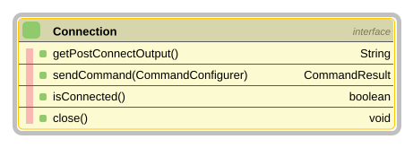
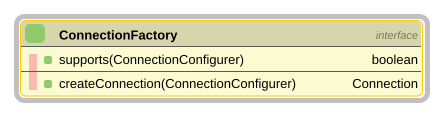
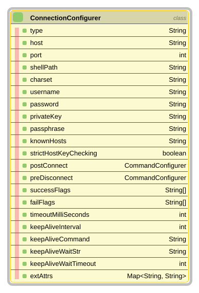
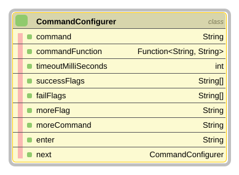
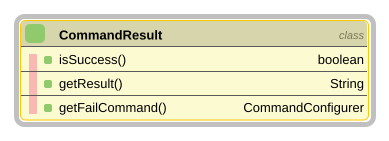
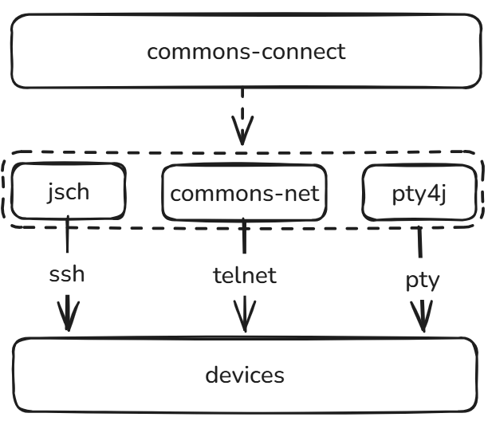

= commons-connect

link:README_en.adoc[English] | 中文

== 简介

=== 特性

commons-connect 为连接设备和下发指令提供了简单易用的 API，主要特性如下

* 支持 SSH、TELNET、SHELL 三种连接类型，且可以自行扩展
* 支持配置指令执行的成功/识别标识和超时时间
* 支持类似--More--的分屏指令
* 支持多条指令链式执行，有一条执行失败就终止
* 支持连接keep-alive

=== 要求

* JDK 1.8+

=== 安装

[source,xml,subs="verbatim"]
----
        <dependency>
            <groupId>io.github.pxzxj</groupId>
            <artifactId>commons-connect</artifactId>
            <version>0.1.0</version>
        </dependency>
----

=== 快速开始

下面是一个简单的使用示例
[source,java,subs="verbatim"]
----
public class StartConnect {

    public static void main(String[] args){
        ConnectionConfigurer connectionConfigurer = ConnectionConfigurerBuilder.ssh()
                                                    .host("192.168.3.1")
                                                    .port(22)
                                                    .username("root")
                                                    .password("pwd")
                                                    .successFlags("#")
                                                    .build();                 // <1>
        Connection connection = new SshConnectionFactory().createConnection(connectionConfigurer);      // <2>
        CommandConfigurer commandConfigurer = CommandConfigurerBuilder.newCommandConfigurer("df -h")
                                                                .successFlags("#")
                                                                .next("pwd")
                                                                .successFlags("#")
                                                                .build();                 // <3>
        CommandResult commandResult = connection.sendCommand(commandConfigurer);          // <4>
        System.out.println("是否执行成功 = " + commandResult.isSuccess());
        if(!commandResult.isSuccess()){
            System.out.println("执行失败的命令 = " + commandResult.getFailCommand());
        }
        System.out.println("执行回显 = " + commandResult.getResult());
        connection.close();                                                              // <5>
    }
}
----
<1> 创建连接配置：协议、设备信息、编码、成功标识，以及登录后要执行的指令
<2> 创建连接
<3> 创建指令配置：指令内容、成功/失败标识、下一条指令
<4> 下发指令，返回结果包含是否成功、失败的指令以及回显
<5> 关闭连接，会先执行 `preDisconnect` 配置的登出指令

== API说明

=== Connection

link:src/main/java/io/github/pxzxj/connect/Connection.java[`Connection`] 接口代表了与设备建立的连接，
连接建立之后可以使用 `sendCommand(CommandConfigurer)` 方法向设备发送指令得到回显，连接使用完成之后必须使用 `close()` 方法关闭

`isConnected()` 方法用于检查连接状态，`getPostConnectOutput()` 可以获取连接建立之后的一些回显，例如ssh的motd内容

根据连接类型的不同 `Connection` 接口有多个实现类，目前支持ssh、telnet、shell这三类，详情参考<<connection-type>>章节

=== ConnectionFactory

link:src/main/java/io/github/pxzxj/connect/factory/ConnectionFactory.java[`ConnectionFactory`] 使用 `createConnection(ConnectionConfigurer)` 方法创建 `Connection`，
使用 `supports(ConnectionConfigurer)` 方法实现策略模式，这一点参考了SpringMVC的 `HandlerMethodArgumentResolver`

=== ConnectionConfigurer

link:src/main/java/io/github/pxzxj/connect/ConnectionConfigurer.java[`ConnectionConfigurer`] 封装了创建连接所需的信息，例如常见的 host、port、username、password等字段，
不同连接类型所需的信息不同，详情参考<<usage>>，
通常使用 link:src/main/java/io/github/pxzxj/connect/ConnectionConfigurerBuilder.java[`ConnectionConfigurerBuilder`] 来创建 `ConnectionConfigurer` 实例

=== CommandConfigurer

link:src/main/java/io/github/pxzxj/connect/CommandConfigurer.java[`CommandConfigurer`] 用于描述执行的命令信息，`command` 代表命令内容，
`successFlags` 和 `failFlags` 代表命令执行的成功标识和失败标识，当回显中出现 `successFlags` 或 `failFlags` 时立即返回并且将命令执行结果设置为成功或失败，
如果 `successFlags` 或 `failFlags` 同时出现视为失败，

当回显中始终未出现 `successFlags` 或 `failFlags` 时就执行到达 `timeoutMilliSeconds` 设置的时间，`timeoutMilliSeconds` 默认为5s，
`successFlags` 和 `failFlags` 都没有设置时就意味着固定等待 `timeoutMilliSeconds` 后再返回

`enter` 用于指定命令下发时的回车符号，默认为 `\n`，可以根据设备支持情况手动调整

部分命令的回显会分屏展示，例如Linux上的 `more` 命令，此时可以通过设置 `moreFlag` 和 `moreCommand` 来实现自动翻屏，从而一次获取到所有回显

`commandFunction` 和 `next` 是为了命令链式执行而设计的，`next` 代表下一条要执行的命令，`commandFunction` 则是用于动态生成命令的场景，根据前面一条命令的回显生成后面一条命令，不过要注意只有前面的命令执行成功才会执行后面的命令

通常使用 link:src/main/java/io/github/pxzxj/connect/CommandConfigurerBuilder.java[`CommandConfigurerBuilder`] 来创建 `CommandConfigurer` 实例

=== CommandResult

link:src/main/java/io/github/pxzxj/connect/CommandResult.java[`CommandResult`] 是 `sendCommand(CommandConfigurer)` 的返回值，通过 `isSuccess()` 判断是否执行成功、`getResult()` 取执行回显、`getFailCommand()` 取执行失败的那条命令

[[connection-type]]
== 连接类型

`commons-connect` 默认支持ssh、telnet、shell这三种类型，用户也可以根据上面的API实现其他连接类型，
shell在Windows下默认使用 `cmd.exe` ，在非Windows下使用 `/bin/bash`，
用户也可以通过修改 `ConnectionConfigurer` 的 `shellPath` 来指定其他shell，例如Windows下还可以使用 `powershell.exe`

如下图所示，这三类连接底层仍然依赖其他库来实现，`commons-connect` 只是将其封装为更简洁易用的API

[[usage]]
== 使用说明与示例

=== ssh密码登录

使用 `username` 与 `password` 属性进行密码登录，端口号为 22 时 `port` 可以省略，`successFlags` 用于指定登录成功后回显的标识

[source,java,subs="verbatim"]
----
ConnectionConfigurer connectionConfigurer = ConnectionConfigurerBuilder.ssh()
        .host("192.168.3.1")
        .port(22)
        .username("root")
        .password("password")
        .successFlags("#")                                                          // 登录成功的标识
        .build();

Connection connection = new SshConnectionFactory().createConnection(connectionConfigurer);
----

=== ssh公钥登录

使用 `privateKey` 属性指定私钥文件进行公钥登录，私钥本身有密码时通过 `passphrase` 属性指定

[source,java,subs="verbatim"]
----
ConnectionConfigurer connectionConfigurer = ConnectionConfigurerBuilder.ssh()
        .host("192.168.3.1")
        .username("root")
        .privateKey("/home/pxzxj/.ssh/id_rsa")
        .passphrase("passphrase")                       // 私钥没有密码时可以省略
        .successFlags("#")
        .build();

Connection connection = new SshConnectionFactory().createConnection(connectionConfigurer);
----

=== telnet连接

部分网络设备基于telnet协议实现了自己的认证过程，在 `postConnect` 中指定认证过程，使用默认端口号23时可以省略 `port`

[source,java,subs="verbatim"]
----
ConnectionConfigurer connectionConfigurer = ConnectionConfigurerBuilder.telnet()
        .host("192.168.3.1")
        .port(31114)
        .successFlags("RETCODE = 0")
        .postConnect(CommandConfigurerBuilder.newCommandConfigurer("LGI:OP=\"user\",PWD=\"pwd\";")
                .successFlags("RETCODE = 0")
                .next("REG NE:Name=\"ne1\";")
                .successFlags("RETCODE = 0")
                .build())
        .preDisconnect(CommandConfigurerBuilder.newCommandConfigurer("UNREG NE:Name=\"ne1\";")
                .successFlags("RETCODE = 0")
                .next("LGO:OP=\"user\";")
                .successFlags("RETCODE = 0")
                .build())
        .build();

Connection connection = new TelnetConnectionFactory().createConnection(connectionConfigurer);
----

=== 默认shell登录

[source,java,subs="verbatim"]
----
ConnectionConfigurer connectionConfigurer = ConnectionConfigurerBuilder.shell()
        .charset("GBK")                             // 中文Windows下cmd.exe的回显编码
        .successFlags(">")
        .postConnect(CommandConfigurerBuilder.newCommandConfigurer("echo hello")
                .enter("\r")                        // Windows下必须使用\r，详见下文
                .successFlags(">")
                .build())
        .build();

Connection connection = new ShellConnectionFactory().createConnection(connectionConfigurer);
----

=== powershell登录

通过 `shellPath` 属性指定 `powershell.exe` 即可；注意 `powershell.exe` 必须把 `enter` 显式设为 `\r`

[source,java,subs="verbatim"]
----
ConnectionConfigurer connectionConfigurer = ConnectionConfigurerBuilder.shell()
        .shellPath("powershell.exe")
        .charset("GBK")
        .successFlags(">")
        .postConnect(CommandConfigurerBuilder.newCommandConfigurer("echo hello")
                .enter("\r")
                .successFlags(">")
                .build())
        .build();
----

=== KeepAlive

`ConnectionConfigurer` 中的 keepAlive 相关配置用于实现连接的keepAlive，
原理也很简单，`keepAliveInterval` 时间内用户没有发送指令时就自动发送一个指令 `keepAliveCommand`，并等待 `keepAliveWaitStr`，等待的超时时间为 `keepAliveWaitTimeout`

通过设置 `keepAliveCommand` 就可以启动keepAlive机制，其他三个字段都有默认值，
要注意的是发送 `keepAliveCommand` 时不会像普通命令那样自动添加 `enter`，因此如果需要发送 `\r` 或者 `\n` 需要显式包含在 `keepAliveCommand` 中

[source,java,subs="verbatim"]
----
ConnectionConfigurer connectionConfigurer = ConnectionConfigurerBuilder.ssh()
        .host("192.168.3.1")
        .username("root")
        .password("password")
        .successFlags("#")
        .keepAliveCommand("pwd\n")                        // 空闲时发送的保活指令
        .keepAliveWaitStr("#")                          // 保活指令等待的回显
        .keepAliveInterval(60000)                       // 空闲多久后发送，单位毫秒，默认60000
        .keepAliveWaitTimeout(2000)                     // 等待回显的超时时间，单位毫秒，默认2000
        .build();
----

NOTE: `keepAliveWaitStr` 默认为一个不会出现在回显中的字符串，此时只能等到超时才知道保活结果，建议设置为设备实际的提示符

=== CompositeConnectionFactory

`CompositeConnectionFactory` 是 `ConnectionFactory` 的组合模式实现，使用它可以创建不同类型的 `Connection`

[source,java,subs="verbatim"]
----
ConnectionFactory connectionFactory = new CompositeConnectionFactory(
        new SshConnectionFactory(), new TelnetConnectionFactory(), new ShellConnectionFactory());
Connection connection = connectionFactory.createConnection(connectionConfigurer);
----

=== 下发指令

`sendCommand()` 返回 `CommandResult`，其中包含是否执行成功、执行失败的指令以及回显

[source,java,subs="verbatim"]
----
CommandConfigurer commandConfigurer = CommandConfigurerBuilder.newCommandConfigurer("df -h")
        .successFlags("#")                                      // 回显中匹配到该标识表示执行成功
        .failFlags("No such file or directory")                 // 回显中匹配到该标识表示执行失败，可选
        .timeoutMilliSeconds(5000)                              // 等待标识的超时时间，单位毫秒，默认5000
        .build();

CommandResult commandResult = connection.sendCommand(commandConfigurer);
System.out.println("是否执行成功 = " + commandResult.isSuccess());
System.out.println("执行回显 = " + commandResult.getResult());
if(!commandResult.isSuccess()) {
    System.out.println("执行失败的命令 = " + commandResult.getFailCommand());
}
----

=== More分屏

[source,java,subs="verbatim"]
----
CommandConfigurer commandConfigurer = CommandConfigurerBuilder.newCommandConfigurer("more bigfile")
        .successFlags("#")
        .moreFlag("--More--")                       // 回显中出现该标识表示还有下一屏
        .moreCommand(" ")                           // 等待期间持续发送的指令，默认空格
        .build();
----

NOTE: `commons-connect` 很难实现像手动发送命令那样看到 `moreFlag` 时发送 `moreCommand`，因此目前采用的是持续发送 `moreCommand` 的方式

=== 多条指令

使用 `next()` 配置下一条指令，多条指令共用一次 `sendCommand()`，任意一条匹配到失败标识就终止，不会再执行后续指令

[source,java,subs="verbatim"]
----
CommandConfigurer commandConfigurer = CommandConfigurerBuilder.newCommandConfigurer("cd /opt")
        .successFlags("#")
        .next("ls")                                 // 上一条执行成功后才执行
        .successFlags("#")
        .next("cat app.log")
        .successFlags("#")
        .build();                                   // build()返回的是第一条指令
----

NOTE: 也可以通过 `CommandConfigurer.setNext()` 组装指令链，此时 `CommandResult.getResult()` 是整条指令链的回显

=== commandFunction

`commandFunction` 用于根据上一条指令的回显动态生成指令内容，它的入参就是上一条指令的回显

[source,java,subs="verbatim"]
----
CommandConfigurer listFiles = CommandConfigurerBuilder.newCommandConfigurer("ls /opt")
        .successFlags("#")
        .build();
CommandConfigurer catFirstFile = CommandConfigurerBuilder
        .newCommandConfigurer(echo -> "cat /opt/" + echo.trim())        // <1>
        .successFlags("#")
        .build();
listFiles.setNext(catFirstFile);

connection.sendCommand(listFiles);
----
<1> 从 `ls` 的回显中取出文件名，拼出下一条指令

== todo

* 在一个临时创建的线程中调用 `connection.sendCommand` 发送命令，线程结束后连接失效，不能继续发送其它命令
* 回显截断字符处理，参考下图

image::images/encode-decode.png[]
